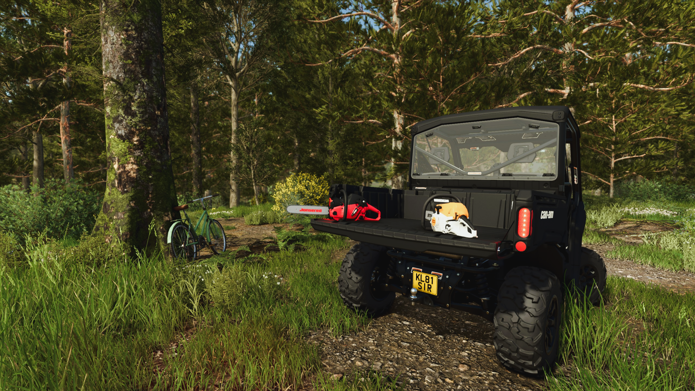
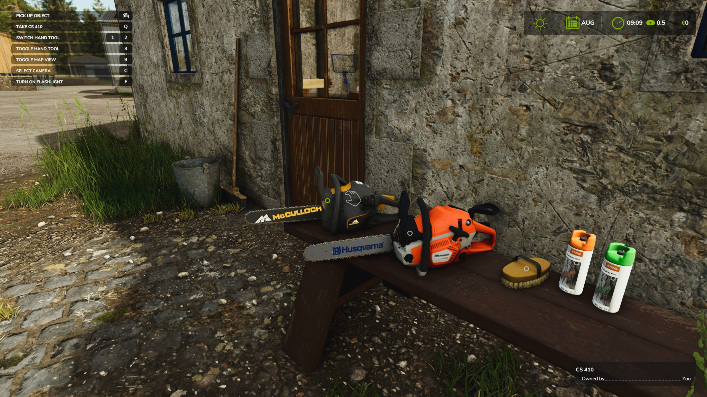
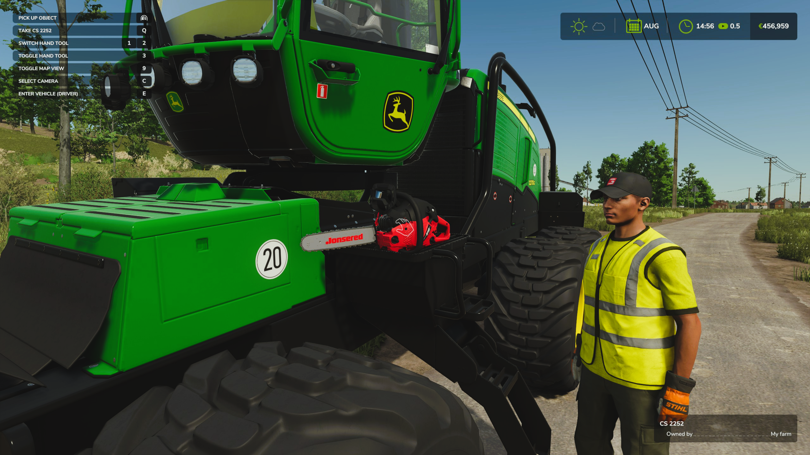

   
  <b>Hand Tool Drop</b> lets you put down supported hand tools &mdash;
   
  carry them by hand, load them for transport and pick them up again later.
   
   

## Features

- **Drop & Pick Up:** Put down a held tool and equip it again when needed.
- **Carry & Transport:** Move dropped tools by hand or secure them with tension belts for transport.
- **Interactive Markers:** Enable interactive zone markers to find nearby tools and see which one is ready to pick up.
- **Savegame Support:** Tools keep their ownership and position when you save and reload your game.
- **Multiplayer Support:** Drop, move and pick up tools in multiplayer.
- **Compatible Hand Tools:** Supports selected tools from the base game, mods and DLCs. See [handToolDrop.xml](handToolDrop.xml) for the supported tools.

## Installation

1. Download the latest version of the mod from the [Releases](https://github.com/modnext/handToolDrop/releases/) page or the official [ModHub](https://www.farming-simulator.com/mod.php?mod_id=377721).2. Copy the downloaded `.zip` file to your Farming Simulator mods folder:
   - Windows: `Documents\My Games\FarmingSimulator2025\mods\`
   - macOS: `~/Library/Application Support/FarmingSimulator2025/mods/`
3. Start Farming Simulator 25 and enable the mod when loading your savegame.

## Keybindings

| Key | Action                                                                            |
| --- | --------------------------------------------------------------------------------- |
| `Q` | Drop your tool or equip the one you look at.                                        |

You can customize this keybinding in the game's Options menu under "Pick Up / Drop".

## Screenshots

## License

Distributed under the GPL-3.0 license. See [LICENSE](LICENSE) for more information.
